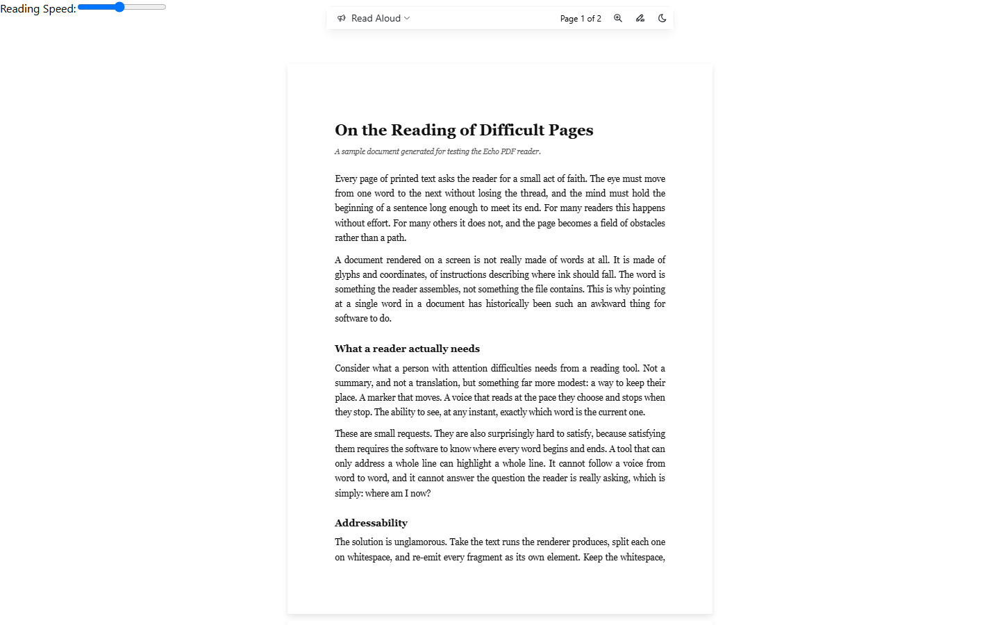
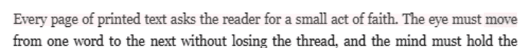

# Echo (EchoPDF)

**An accessible PDF reader that wraps every single word in its own element — so it can read aloud, highlight, and track your focus word by word.**

Reading a dense PDF with a wandering brain is a fight. Echo renders PDFs in the browser and layers focus aids on top: read-aloud with word-level highlighting, a cursor-tracking mode, and an experimental eye-tracking mode.

Accessibility features usually get bolted on last. Echo is what happens when they are the whole product.



*The reader with [`docs/sample-document.pdf`](docs/sample-document.pdf) loaded.*


*Cursor Tracking active. The word under the cursor gets the highlight colour; the line it belongs to gets a softer tint of the same colour, so the active word stays distinguishable.*


*Read-aloud following the voice word by word. Each step is one `boundary` event from the utterance.*



*The toolbar's colour swatches applied to the active word.*

<sub>All captures are of the app running locally against the sample PDF. This machine exposes no `speechSynthesis` voices to automated browsers, so the cursor-tracking and read-aloud captures supplied the `boundary` events an OS voice would normally emit — one per word, with the `charIndex` and `charLength` a real engine reports. Everything that moves in them is the app's own code reacting to those events.</sub>

---

## The technical move: rebuilding the text layer word by word

A PDF has no notion of a "word you can point at." pdf.js paints the page to a `<canvas>` and then renders an invisible text layer over it — but that layer groups text into runs, typically a whole line or phrase per `<span role="presentation">`. You can select it, you can't *address* it. There is no element that means "this word."

So Echo rebuilds it. After pdf.js finishes rendering the text layer, Echo walks every presentation span, splits its text on whitespace, and re-emits each word as its own `<span class="word">`. Whitespace is preserved as its own span so the visual layout stays identical to what pdf.js produced.

Once every word is an element, everything else becomes cheap. Highlighting a word is a class toggle. Finding the word under the cursor is `document.elementFromPoint`. Following speech is holding the ordered spans a sentence was built from and resolving each `boundary` event's `charIndex` back to one of them. The hard problem is solved once, in one place.

**Where it lives:** [`src/components/PDFPage/PDFPage.js`](src/components/PDFPage/PDFPage.js) — the `memoizedTextLayer` memo inside the `PdfPage` component.

```js
// src/components/PDFPage/PDFPage.js — inside PdfPage's memoizedTextLayer
page.getTextContent().then(async (textContent) => {
  // 1. Let pdf.js build its normal text layer first. This gives us correctly
  //    positioned spans — one per text run, not one per word.
  await pdfjs.renderTextLayer({
    textContentSource: textContent,
    container: textLayerRef,
    viewport: viewport,
    textDivs: [],
  });

  // 2. Grab every run pdf.js emitted.
  const textElements = textLayerRef.querySelectorAll('span[role="presentation"]');

  textElements.forEach((textElement) => {
    // 3. Split on whitespace but KEEP the whitespace — the capture group in
    //    the regex means the separators survive in the output array. Dropping
    //    them would collapse spacing that the canvas underneath still shows.
    const wordsAndWhitespaces = textElement.innerHTML.split(/(\s+)/);

    // 4. Re-emit each fragment as its own addressable element.
    const wrappedContent = wordsAndWhitespaces.map((item) => {
      const span = document.createElement("span");
      span.classList.add("word");
      span.textContent = item;
      return span.outerHTML;
    });

    // 5. Swap the run's contents for the per-word spans. Position and
    //    transform live on the parent run, so nothing moves.
    textElement.innerHTML = wrappedContent.join("");
  });
});
```

The parent run keeps the `left` / `top` / `transform` that pdf.js computed, and the word spans are inline children inside it — which is why the rebuild is purely additive and does not disturb layout. The parent is also what the aids use for line-level context: "read from here to the end of the sentence" is a walk over `selectedSpan.parentElement.children`.

## Architecture

```
PDF file (drag & drop)
   |
   v
pdf.js getDocument()                          src/App.js
   |
   v
per page: render to <canvas>                  src/components/PDFPage/PDFPage.js
   |
   +--> pdf.js renderTextLayer()  ->  spans per text RUN
   |         |
   |         v
   |    REBUILD: split each run, wrap every word in <span class="word">
   |         |
   v         v
canvas + word-addressable text layer, absolutely positioned on top
   |
   v
focus aids layered over the word spans
   - cursor tracking + speech       src/components/CursorTracker/CursorTracker.js
   - toolbar, zoom, themes, colours src/pages/PDFViewer.js
```

| File | Role |
| --- | --- |
| `src/App.js` | Reads the dropped file, hands the `ArrayBuffer` to pdf.js, sets the pdf.js worker source |
| `src/pages/Home.js`, `src/components/DropZoneButton/` | Landing page and PDF drop target |
| `src/pages/PDFViewer.js` | Floating toolbar, scroll-based page tracking, zoom, highlight colours, light/dark toggle |
| `src/components/PDFPage/PDFPage.js` | **Canvas render + the word-span text layer rebuild** |
| `src/components/CursorTracker/CursorTracker.js` | Cursor hit-testing, sentence queueing, Web Speech synthesis, karaoke highlighting |

## Features

- **Read aloud with word-level highlighting.** Sentences are queued and spoken via the Web Speech API, and the word being read is marked with `.selected` while the line around it takes a softer tint of the same colour. Each sentence is queued together with the ordered `.word` spans it was built from and the character offset of each one inside the utterance text, so the utterance's `boundary` event resolves by `charIndex` straight to the span being spoken — the highlight steps word by word in time with the voice, and a voice that skips or repeats a token cannot knock it out of sync.
- **Cursor tracking.** Point at a word and Echo starts reading from there. It hit-tests with `document.elementFromPoint`, builds a queue of sentences from that word to the end of the run, and — when the queue drains — picks the geometrically next run (nearest on the same line, else nearest line below) and keeps going. Reading continues until the queue drains or you point somewhere else; you do not have to keep the cursor moving.
- **Eye tracking — experimental.** See the note below.
- **Floating toolbar.** Zoom slider, live "page N of M" derived from scroll position, highlight colour swatches, and a light/dark reading mode toggle. The toolbar fades out as you scroll into the document and returns when the cursor nears the top of the window.
- **Reading themes and highlight colours.** Light/dark via Mantine's colour scheme; highlight colour is driven by CSS custom properties (`--highlight-color`, `--highlight-color-parent`) so the active word and its surrounding line can be tinted independently.
- **Adjustable reading speed.** Rate control wired to `SpeechSynthesisUtterance.rate`.

### Status: eye tracking is experimental

To be clear about this one: **eye tracking is not implemented yet.** The mode appears in the read-aloud menu, is labelled `BETA` in the UI, and is reserved as the next input source to plug into the same word-span layer that cursor tracking already uses. Selecting it currently does nothing. The interesting half — making every word a hit-testable target — is done; the gaze input is not.

Cursor tracking and read-aloud are the working, demonstrable modes.

## Quickstart

Requires Node.js 18 or newer.

```bash
git clone https://github.com/Arty2001/echopdfreact.git
cd echopdfreact
npm install
npm start
```

Open <http://localhost:3000> and drop a PDF onto the upload zone — [`docs/sample-document.pdf`](docs/sample-document.pdf) is included if you want one to hand. Then open the **Read Aloud** menu in the floating toolbar and choose **Cursor Tracking**, and move your cursor over any word to start reading from it. Reading carries on from there until the sentence queue drains or you point at a different word.

Production build:

```bash
npm run build   # outputs to ./build
```

Note: the pdf.js worker is loaded from a CDN (`cdnjs.cloudflare.com`, pinned to pdf.js 4.2.67 in `src/App.js`), so the first render needs network access. Point `pdfjs.GlobalWorkerOptions.workerSrc` at a local copy if you need it to run fully offline.

## Browser support

Honest version: **this depends heavily on the browser, and Chrome is the reliable one.**

- **The Web Speech API (`speechSynthesis`) is not uniformly implemented.** Echo's karaoke highlighting depends on the utterance `boundary` event firing with `name === "word"`. Chrome and Edge fire these reliably for local voices; Firefox's support has historically been inconsistent; Safari fires them but voice and rate behaviour differs. Where `boundary` does not fire, speech still works — the word-level highlight simply will not advance.
- **Available voices belong to the operating system, not the app.** Voice quality and language coverage vary by machine, and some platforms only expose the voice list after a user gesture.
- **Remote/network voices** may not emit `boundary` events at all, even in Chrome.
- The canvas rendering and the word-span text layer itself have no exotic requirements and work anywhere pdf.js works.

Recommended for evaluation: a recent desktop Chrome or Edge.

## Built with

React 18 · pdf.js (`pdfjs-dist`) · Web Speech API · Mantine · Framer Motion · Create React App

## Known rough edges

This is a working prototype, kept honest rather than polished. The list below was checked against the app actually running, not read off the source:

- **The reading-speed slider is unstyled and unplaced.** `CursorTracker` renders it as a bare `<label>` at the top-left of the document rather than inside the floating toolbar — visible in the screenshot above.
- Zoom is applied through a `--scale-factor` CSS variable; the canvas itself is rendered at scale 1, so heavy zoom softens the page.
- Page dimensions are shared across all pages, which assumes a uniform page size within a document.
- Sentence splitting is punctuation-based (`.`, `!`, `?`) and will split on abbreviations.
- `.selected-parent` in `CursorTracker.css` is never applied by any code path; the line tint is carried by the run's own `.selected` rule.

Recently fixed:

- **The karaoke highlight now advances word by word.** The `boundary` handler used to locate the active element with `document.querySelector('.selected')`, but `.selected` sits on the active word *and* on its parent text run, and the run precedes its own children in document order — so the query returned the run and the handler walked sibling *runs* instead of sibling *words*. Sentences now carry their ordered `.word` spans and each span's character offset in the utterance text, and the handler resolves `boundary.charIndex` to a span directly.
- **The highlight starts on the right word.** A queued sentence used to carry the span it *ended* on, so the highlight appeared on the sentence's last word; it now carries the span it starts on.
- **Reading no longer stops when the cursor does.** The idle-cancel timer that killed speech 350ms after the last mouse movement is gone.
- The active-word highlight ignored the toolbar's colour swatches because `.selected` hard-coded `background-color: black`. It now reads `--highlight-color`, with the surrounding run taking the softer `--highlight-color-parent` tint.

## Credits

Built by [@Arty2001](https://github.com/Arty2001) with contributions from [@reheant](https://github.com/reheant) (Rehean Thillai), Joerex Thambaiah, and Abilash — see the [commit history](https://github.com/Arty2001/echopdfreact/commits/master) for the full record.

## License

[MIT](LICENSE) © 2024 Arty2001
